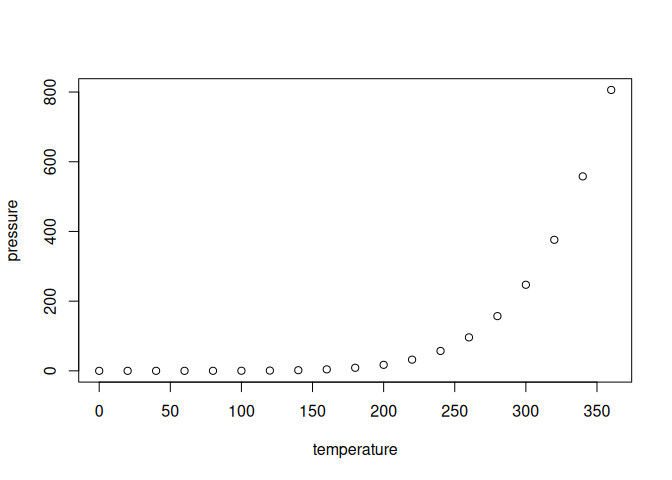

<!-- README.md is generated from README.Rmd. Please edit that file -->

# Assignment-B3: Biological Oscillation.

Here, I design and create a series of biological oscillators as
described in *Uri Alon - An Introduction to Systems Biology* - Chapter
6. The goal is to show how we can model these dynamical processes in R,
and allow users to moderate the parameters through an interactive GUI.

The system is solved using the deSolve and cOde packages, which allow
for fast solving and compilation of systems of ordinary differential
equations.

First, we build a damped oscillator, which is a two-component system. It
comes with a dynamic user interface to edit the simulation time and the
individual rate parameters.

Next, we build an undamped multi-component oscillator. This has the
capacity to oscillate indefinitely, even without noise. Here, we
showcase a 3-component system, in which each component has negative
feedback on the following component.

<!-- -->

Finally, we showcase a coupled feedback loop, which has two components,
but one component is autoregulated with positive feedback. This creates
oscillations using only two components and without noise.
