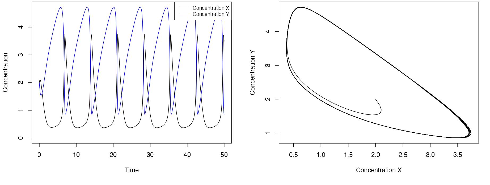

<!-- README.md is generated from README.Rmd. Please edit that file -->

# Assignment-B3: Biological Oscillation.

## Usage

Run the Shiny App located in /Alon_Oscillator/. All of the models should
already be compiled there.

## Design

Here, I design and create a series of biological oscillators as
described in *Uri Alon - An Introduction to Systems Biology* - Chapter
6. The goal is to show how we can model these dynamical processes in R,
and allow users to moderate the parameters through an interactive GUI.
Additionally, it gives context to which conditions lead to oscillations,
and which lead to flat systems.

The system is solved using the deSolve and cOde packages, which allow
for fast solving and compilation of systems of ordinary differential
equations.

### First, we build a damped oscillator.

This is a two-component system. It comes with a dynamic user interface
to edit the simulation time and the individual rate parameters. This was
modelled after Chapter 6.1 in Uri Alon’s book.

Damped Oscillations

### Next, we build an undamped 3-component oscillator

Also known as a *repressilator*. Here, we showcase a system in which
each component has negative feedback on the following component. This
has the capacity to oscillate indefinitely. The ideas for the specific
ODE system were modeled after work done by Michael Elowitz, here:
<https://biocircuits.github.io/chapters/09_repressilator.html>

3 Component Oscillation

### Finally, we showcase the Brusselator

Thich has two intermediary components, X and Y, under investgation, but
the mechanism can produce stable oscillations. This was modeled after
work done by Thomas Petzoldt, here:
<https://tpetzoldt.github.io/deSolve-shiny/deSolve-shiny.html>

Brusselator visualization

I hope you find this work interesting, and allows you to visualize the
mathematics underlying oscillations!
